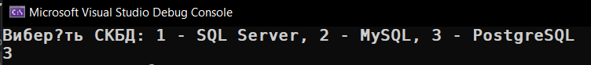
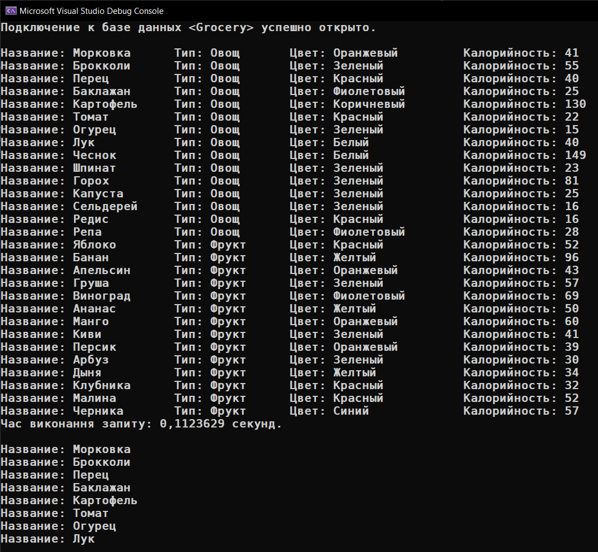
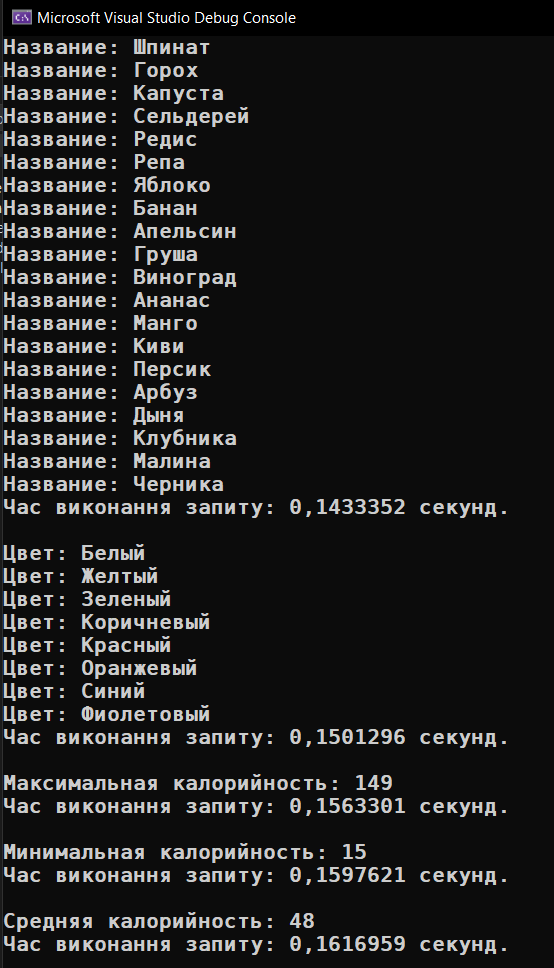
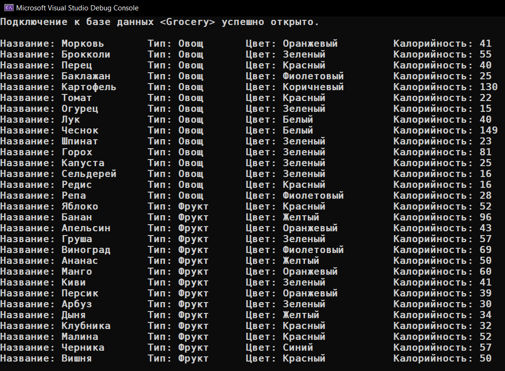
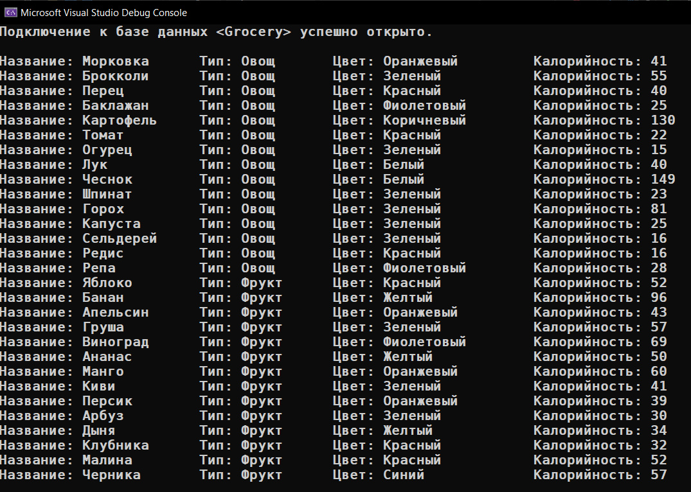

# Module 3

<table>
  <tr>
    <h2>Task 1-2-6-7</h2>
    <a href="Task_1-2-6-7/Program.cs">-> Task_1-2-6-7.cs - code</a>
    <td width="50%">
        
        
    </td>
    <td width="35%">
        
    </td>
  </tr>
</table>

<table>
  <tr>
    <h2>Task 3-4-5</h2>
    <a href="Task_3-4-5/Program.cs">-> Task_3-4-5.cs - code</a>
    <td></td>
    <td></td>
  </tr>
</table>
